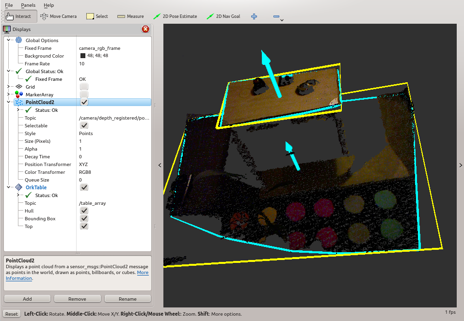

:orphan:

.. _rviz:

RViz Plugin
###########

`RViz <http://www.ros.org/wiki/rviz>`__ is a visualizer for ROS. ``ORK`` supports two plugins for object introspection.

Table Plugin
------------

This plugin can display a ``Table.msg``, as can be found by the :ref:`Tabletop <orktabletop:tabletop>` pipeline for example.

It displays the hull of the convex found table, a bounding box and a vector pointing towards the top of the table.

Object Plugin
-------------

This plugin can display a ``RecognizedObject.msgs``, the default output of ``ORK``.

TODO screenshots

